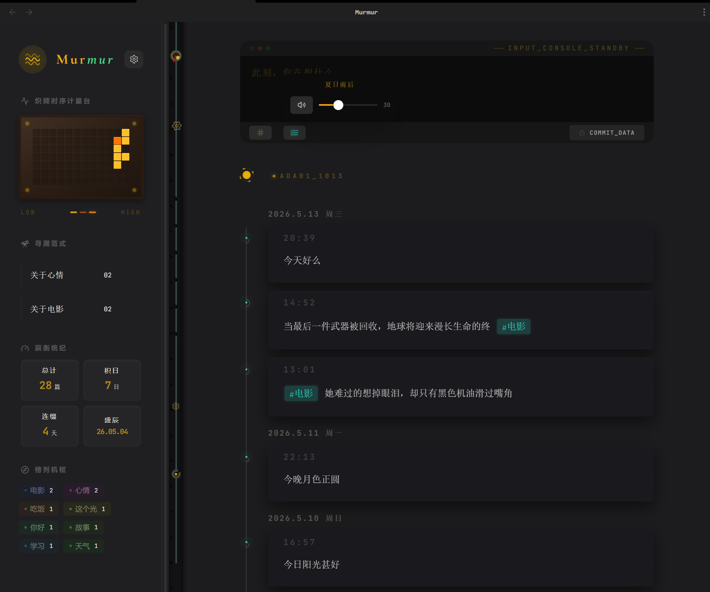
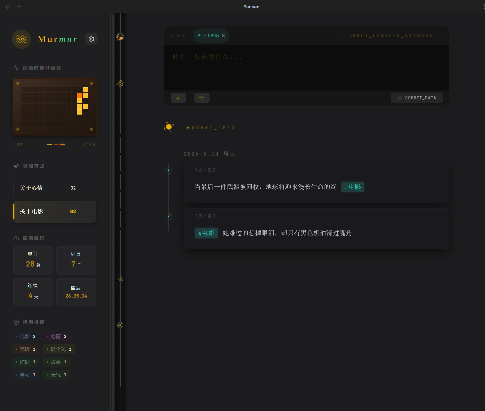

# Murmur

[English](#english) | [简体中文](#chinese)

A retro-terminal style inner monologue recorder for Obsidian. Amidst the silent rotation of mechanical gears, turning murmurs into energy fragments.

## Features

- **Retro-Terminal Aesthetic**: A unique design inspired by vintage computing and cyberpunk consoles.
- **Daily Timeline**: Automatic extraction of content from your daily notes, organized by time.
- **Activity Heatmap**: Visualize your writing consistency over the past months.
- **Zen Background Music**: Integrated ambient sounds (Rain, Mountains & Rivers, Birds) to help you focus.
- **Responsive Layout**: Seamlessly transitions between wide desktop views and compact mobile-friendly sidebars.
- **Theme Aware**: Perfectly adapts to both Obsidian Light and Dark themes with custom vintage color palettes.

## Core Concepts

Murmur uses a unique set of terminologies to describe its functional components:

- **Search Paradigms**: Forgeable advanced filter chains. Combine tags, text, and dates into a "Paradigm" to slice through your history with precision.
  
- **Murmur Stats**:
  - **Total Days**: Total unique days you've recorded a murmur.
  - **Streak**: Your longest consecutive recording streak.
  - **Peak Day**: The specific date with the highest recording density.
- **Tag Registry**: A dynamic dashboard for your tags, **sorted by usage frequency**. Each tag is assigned a deterministic visual style based on its name, helping you identify your main train of thought at a glance.
- **ADA01_1013**: A tribute status code. **ADA** honors Ada Lovelace, the first programmer; **01** represents her status as "The First"; **1013** marks Ada Lovelace Day (**the second Tuesday of October**). It signifies a stable, harmonious system state.

## Installation

### Community Store (Recommended)
1. Open Obsidian **Settings**.
2. Go to **Community plugins** and click **Browse**.
3. Search for **Murmur**.
4. Click **Install**, then **Enable**.

### Manual Installation
1. Download the latest `murmur.zip` from the [GitHub Releases](https://github.com/fanxiaofang/obsidian-murmur/releases).
2. Extract the contents of the zip file into your vault's `.obsidian/plugins/murmur` directory (create the `murmur` folder if it doesn't exist).
3. Ensure that `main.js`, `manifest.json`, and the `audio` folder are all placed directly inside the `murmur` folder.
4. Reload Obsidian and enable the plugin in **Community plugins**.

## How to Use

1. Click the **Waves** icon in the ribbon or use the command palette to open the Murmur view.
2. Ensure your daily notes follow a standard date format (like `YYYY-MM-DD`).
3. Click on the **Signal Flow (Waves)** icon at the bottom to toggle background music.
4. Hover over timeline items to see the detail cards.

## Configuration

In the plugin settings, you can:
- Enable/disable animations for performance.
- Set default background music and volume.
- Customize the responsive layout threshold.

---

## 简体中文

为Obsidian 设计的复古终端式内心独白记录，在无声转动的机械齿轮中，把呢喃低语化为能量碎片

## 特性

- **复古终端美学**：受复古计算和赛博朋克控制台启发而设计的独特风格。
- **每日时间轴**：自动从您的每日记录中提取内容，按时间排序。
- **活动热力图**：可视化您过去几个月的写作频率。
- **背景音乐**：集成环境音（雨声）帮助您集中注意力。
- **响应式布局**：在宽屏桌面视图和适配移动端的侧边栏视图之间无缝切换。
- **主题适配**：完美适配 Obsidian 的深色和浅色主题，配有自定义复古调色盘。

## 核心概念说明

Murmur 使用了一套独特的术语来描述其功能组件：

- **寻溯范式 (Search Paradigms)**：可“锻造”的高级过滤器链。将标签、文本、日期等条件组合成一个持久化的“范式”，精准切开记忆的脉络。
  
- **辰衡统计 (Murmur Stats)**：
  - **积日 (Total Days)**：总记录天数。
  - **连缀 (Streak)**：历史最长连续记录天数。
  - **盛辰 (Peak Day)**：单日记录密度最高的时刻。
- **榜列机枢 (Tag Registry)**：标签的动态仪表盘，**按使用频率自动排序**。系统会根据标签名称通过算法分配唯一的视觉标识，助你一眼识别思维的主脉络。
- **ADA01_1013 (系统状态码)**：一个致敬代码。**ADA** 代表史上第一位程序员 Ada Lovelace；**01** 代表“第一位”；**1013** 代表全球埃达纪念日（**每年 10 月的第二个星期二**）。在插件中，它寓意系统运转平稳，数据逻辑圆满。

## 安装方式

### 社区插件市场 (推荐)
1. 打开 Obsidian **设置**。
2. 前往 **社区插件** 并点击 **浏览**。
3. 搜索 **Murmur**。
4. 点击 **安装**，然后 **启用**。

### 手动安装
1. 从 [GitHub Releases](https://github.com/fanxiaofang/obsidian-murmur/releases) 下载最新的 `main.js`、`manifest.json` 以及 `styles.css` 。
2. 将文件移动到 `.obsidian/plugins/murmur` 目录下。
3. 重启 Obsidian 或在**社区插件**设置中点击“重新加载”，然后启用插件。

## 如何使用

1. 点击侧边栏的 **Waves** 图标或使用命令面板打开 Murmur 视图。
2. 确保您的每日记录遵循标准日期格式（如 `YYYY-MM-DD`）。
3. 点击底部的 **信号流 (Waves)** 图标切换背景音乐。
4. 悬停在时间轴项目上查看详情卡片。

## 配置选项

在插件设置中，您可以：
- 开启/关闭动画以优化性能。
- 设置默认背景音乐及音量。
- 自定义响应式布局的阈值。

---

## Support & License / 支持与许可

### Support / 支持
If you encounter any bugs or have feature requests, please [open an issue](https://github.com/fanxiaofang/obsidian-murmur/issues).
如果您遇到任何错误或有功能请求，请[提交 issue](https://github.com/fanxiaofang/obsidian-murmur/issues)。

### License / 许可
MIT License. See [LICENSE](LICENSE) for details.
MIT 许可证。详情请参阅 [LICENSE](LICENSE)。
